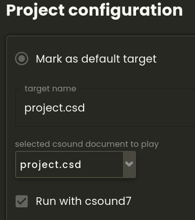

Csound 7 is now available to use in any browser!

Thanks to work of Hlodver Sigurdsson and Steven Yi you can try out the [numerous new features of Csound 7}(https://csound.com/manual/intro/whats-new-in-csound-7/) in the Csound Web IDE.

There is a [Csound 7 Playground](https://ide.csound.com/editor/ehqAG0RduZT91trCgl9A) in which you can type and run any code.

In your own account, click the "run with csound7" checkbox in the project configuration:

You can also use Csound 7 now in the [Csound FLOSS Manual](https://flossmanual.csound.com/). Just type any code in the *TryMe* instrument at [https://flossmanual.csound.com/introduction/preface](https://flossmanual.csound.com/introduction/preface).
