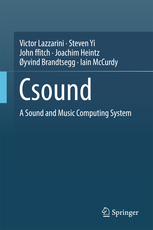
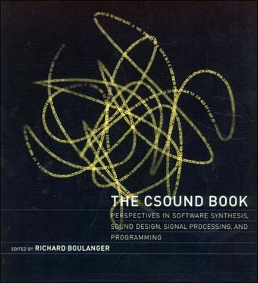
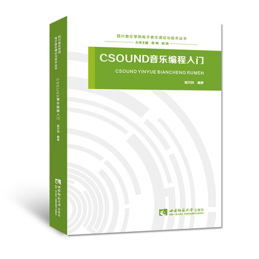

## Csound: A Sound and Music Computing System

Year: 2016 
Authors: V. Lazzarini, S. Yi, J. ffitch, J. Heintz, Ø. Brandtsegg, I. McCurdy 
Link: [http://www.springer.com/gp/book/9783319453682](http://www.springer.com/gp/book/9783319453682)

---

## The Csound Book

Year: 2000 
Editor: R. Boulanger 
Link: [https://mitpress.mit.edu/books/csound-book](https://mitpress.mit.edu/books/csound-book)

_Download Csound Book CD-ROMS_

* [2011 New DVD Master (2.68GB)](https://www.dropbox.com/s/b7p9d0med6w34ti/2011_Second_Printing_NEW_DVD_Master.zip?dl=0)
* [2000 Original HTML and DATA CD-ROMS (1.08GB)](https://www.dropbox.com/s/k9a0fakgcghebk3/2000_First_Printing_HTML%2BDATA_CD_Masters.zip?dl=0)
* [Csound Book Chapter 1 (806KB)](https://www.dropbox.com/s/r8giqor5v3b2z34/CsoundBookCh1.zip?dl=0)

---

## Virtual Sound

Year: 2008 
Authors: R. Bianchini, A. Cipriani 
Link: [http://www.amazon.com/Virtual-Sound-Synthesis-Processing-Practice/dp/8890026146](http://www.amazon.com/Virtual-Sound-Synthesis-Processing-Practice/dp/8890026146)

---

## CSOUND音乐编程入门 (Music Programming with Csound)

Press: 西南师范大学出版社 (Southwestern Normal University Press) 
Year: 2015.09 
Author: 杨万钧 (Wanjun Yang)  
ISBN: 978-7-5621-7547-6  
Link: [https://detail.tmall.com/item.htm?id=523778675175&ns=1&abbucket=5](https://detail.tmall.com/item.htm?id=523778675175&ns=1&abbucket=5)

---

## Csound Power

Year: 2012 
Author: J. Aikin 
Link: [http://www.amazon.com/Csound-Power-Jim-Aikin/dp/1435460049](http://www.amazon.com/Csound-Power-Jim-Aikin/dp/1435460049)

---

## Inside Csound

Year: 2014 
Author: G. Zucco 
Link: [http://www.ibs.it/code/9788888849904/zucco-giorgio/inside-csound-ediz.html](http://www.ibs.it/code/9788888849904/zucco-giorgio/inside-csound-ediz.html)

---

## The Audio Programming Book

Year: 2010 
Editors: R. Boulanger, V. Lazzarini  
Link: [https://mitpress.mit.edu/books/audio-programming-book](https://mitpress.mit.edu/books/audio-programming-book)

---

## The Csound FLOSS Manual

Year: 2015 
Editors: J.Heintz, I. McCurdy, M. Knevel  
Link: [lulu.com](http://www.lulu.com/shop/joachim-heintz-and-iain-mccurdy/csound-floss-manual/paperback/product-22359512.html)

---

## Ways Ahead: Proceedings of the First International Csound Conference

Year: 2012 
Editors: J.Heintz, A. Hofmann, I. McCurdy  
Link: [http://www.cambridgescholars.com/ways-ahead-13](http://www.cambridgescholars.com/ways-ahead-13)

---

## Cooking With CSound Part 1: Woodwind and Brass Recipes

Year: 2002 
Authors: Andrew Horner and Lydia Ayers 
Link: [http://www.areditions.com/horner-cooking-with-csound-das018.html](http://www.areditions.com/horner-cooking-with-csound-das018.html)

---

## Generación y procesamiento de sonido y música a través del programa Csound

Year: 2004 
Author: Oscar Pablo Di Liscia 
Link: [http://www.unq.edu.ar/catalogo/103-generaci%C3%B3n-y-procesamiento-de-sonido-y-m%C3%BAsica-a-trav%C3%A9s-del-programa-csound.php](http://www.unq.edu.ar/catalogo/103-generaci%C3%B3n-y-procesamiento-de-sonido-y-m%C3%BAsica-a-trav%C3%A9s-del-programa-csound.php)

---

##  Музыкальные компьютерные технологии. Современный инструментарий творчества.

Year: 2005 
Authors: Станислав Пучков (Stanislav Puchkov), Михаил Светлов (Mikhail
Svetlov) 
Link: [http://search.rsl.ru/ru/record/01002913736](http://search.rsl.ru/ru/record/01002913736)

